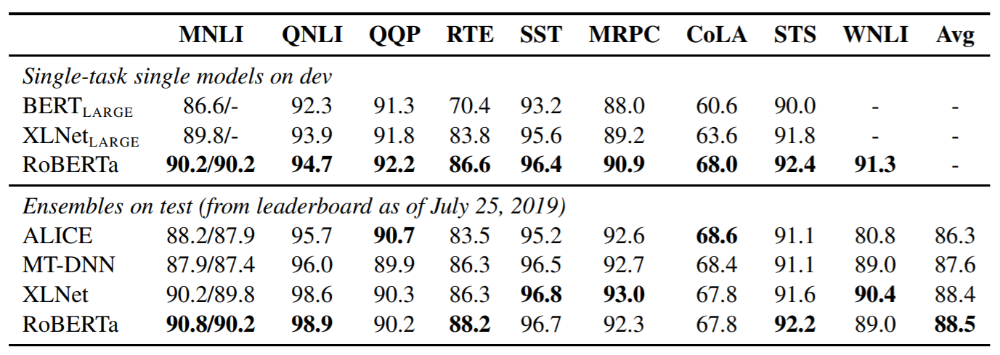
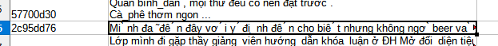
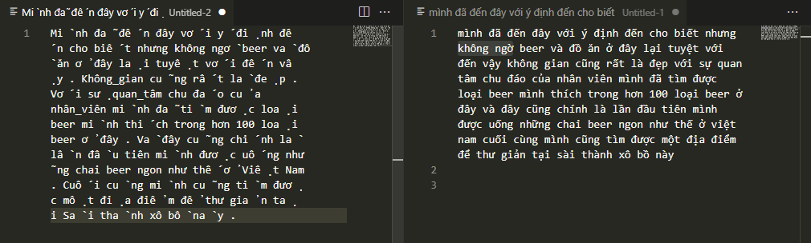
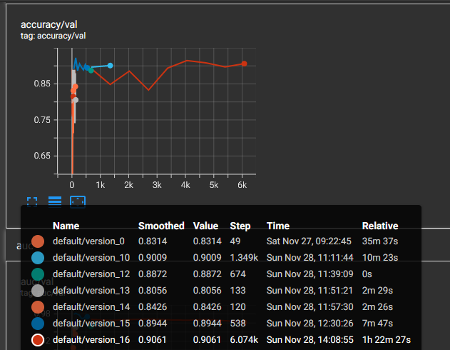

# Final BERT Report

Name: Nguyễn Vũ Bình Dương

Student ID: 19020060

Github repo: https://github.com/duongoku/INT3405

## Summary and Contributions

Here you should describe in short what is authors doing, what are the problems authors are solving, and the main difference with previous methods, this often be directly stated by authors in the abstract section of the paper.

BERT is designed by a team at Google. It aims to pre-train bidirectional representations from unlabeled text.

The main difference between BERT and previous methods is that BERT is truly bidirectional while prior models are unidirectional (ELMo is unidirectional since it still uses left-to-right and right-to-left LSTM and then combine them together). Furthermore, BERT uses transformer which allows parallel training.

## Strengths

- BERT can represent words meaning very well because it used context from both directions.
- It allows parallelization.
- It's already pre-trained so users can just append a few more layers(even one more layer is enough) to perform a specific task.

## Weaknesses

- BERT only supports up to 512 tokens.
- Pure BERT is very costly to train, since it's a huge model.
- There are some tasks that BERT is not very good at:
    - It can't understand and use the context in the previous sentence very well when predicting.
    - It also doesn't perform good at negation when predicting.
    - It struggles with layered inferences.

## Relation to Prior Work

BERT uses a masked language model pre-training objective, inspired by the Cloze task ([Wilson L Taylor. 1953. Cloze procedure: A new tool for measuring readability. Journalism Bulletin, 30(4):415–433.](https://www.gwern.net/docs/psychology/writing/1953-taylor.pdf)). This model randomly masks a portion of words in a sentence and its objective is to predict those masked word, given the context (which is the masked sentence).

## **After paper release**

[RoBERTa](https://arxiv.org/abs/1907.11692) is one of BERT's succesor. It tackles the computational cost problem of BERT. The reseachers modified some aspects of BERT in order to achieve improvement:

- Training the model with bigger batches of data and more data (10 times bigger than one used for training BERT).
- Training the model on longer sequences.
- Removing next sentence prediction objective.
- Dynamically changing the masking pattern applied to the training data (masked token are changed in each epoch).

Performance comparison

## Dataset

I used provided training data from [here](https://drive.google.com/drive/folders/1nwl9mcnkDAD7q01QcdVytRUlcdH7W28n?usp=sharing) (shopee sentiment dataset).

This dataset contains 27000 rows/reviews of data, written in Vietnamese and each row/review is labeled with 0 or 1, stands for negative or positive accordingly.

When trying to pre-process the original data, I struggled with separated accents and letters as mentioned in the [initial report](https://www.notion.so/Initial-BERT-Report-12f4ca2c17544f9ea5baaa28471a8d51). In total, there are 1195 rows contains text like this so obviously we can't do that by hand.

The problematic text

In the beginning, directly normalize whole string didn't work. I noticed that all the accents are sandwiched between spaces character so I tried to remove those spaces and tried to normalize the string again. And apparently, it worked, but the downside is now some words are stuck together.

Fortunately, the famous [stackoverflow community](https://stackoverflow.com/questions/8870261/how-to-split-text-without-spaces-into-list-of-words/11642687#11642687) helped me solve this problem. Basically, by using a word list, we can separate those words easily. So I tried to reimplement the algorithm mentioned on the website and the result looks quite promising and of course it's not perfect, but I tried my best. Special thanks to [Trần Xuân Hải](https://github.com/XanMarta) for helping me in finding the solution and also the [word list](https://github.com/garfieldnate/vi_experiments/tree/master/wiki_word_list).

Side-by-side comparison

After dealing with above strings, the remaining data pre-processing is pretty easy, remove punctuation and excess spaces.

P.S. The runtime of my data pre-processing source code is a bit slow.

# Implementation

The modified code from provided sample code is available [here](https://colab.research.google.com/drive/1K1zDUP9ojIboTcQkGmR2CGcEtc6-U4Fn?usp=sharing) (This is different from the one in the [Initial BERT Report](https://www.notion.so/Initial-BERT-Report-12f4ca2c17544f9ea5baaa28471a8d51)).

After struggling with building a pytorch lightning model from scratch with [PhoBERT](https://huggingface.co/vinai/phobert-base) (I don't think), I decided to just use the provided sample code and modify it. I also tried to make another one myself with [envibert](https://huggingface.co/nguyenvulebinh/envibert) but I couldn't figure it out. I've deleted all my failed attempt since the code didn't even work so I can't reference my failed experiments here.

In order to debug and have faster training time for testing, I added [data_portion parameter to the DataModule class](https://colab.research.google.com/drive/1K1zDUP9ojIboTcQkGmR2CGcEtc6-U4Fn?authuser=2#scrollTo=PzegOvuxhla8&line=13&uniqifier=1) so it will just take a portion of data from input file. Otherwise it'd take about 90 minutes to train.

So based on what I've research (from [here](https://jalammar.github.io/a-visual-guide-to-using-bert-for-the-first-time/)(use Logistic Regression from scikit-learn), [here](https://www.kaggle.com/heyytanay/bert-with-pytorch-lightning-tpu-for-sentiments) and [here](https://towardsdatascience.com/how-to-fine-tune-bert-with-pytorch-lightning-ba3ad2f928d2)), in order to predict the sentiment of a review, each word in that sentence need to be tokenized based on a pre-trained model and then those tokens are passed through that pre-trained model to output a set of embeddings. Those embeddings are now passed through another layer to classify them into negative or positive sentiment (could be a Logistic Regression or Sequence Classification layer or something else).

This is the accuracy over validation graph:

Accuracy over validation means the accuracy computed on a validation set. This means it predicts correctly 9 out of 10 times on a new data since the validation set is different from the training set.

This is the recall graph:

Recall over validation is the number of items correctly predicted of a label over the number of items with that label in the validation set.

After testing, I found out that the model works poorly on sentences like this: *"mình kêu 6 loại khác nhau mỗi loại 1 cục mà ăn cái nào cũng như nhau cứ như đang ăn 1 loại vậy cuối cùng ngon nhất lại là cục khoai môn chiên mấy loại há cảo xíu mại bánh xẹp ăn ngán cực kỳ mà làm cục to tổ bố để ép khách mua với cái giá 19 k ko hiểu ăn được cái gì ở đây mà có người khen ngon"*. Which contains 2 positive words "ngon".

# Conclusion

Training result:

log

Figures: available on [tensorboard.dev](https://tensorboard.dev/experiment/3zmIM8QqS4y7aE8Tz0PkXQ/#)

accuracy/val

recall/val

I think the model itself doesn't have any significant problem other than from [here](), we can improve the accuracy by using more data with many cases like [this]().

# Additional Experiment

Because working with Vietnamese is much harder since the support from the internet is not as much as English, I tried to conduct another experiment but this time, I'm using RoBERTa on an English dataset. The notebook for this additional experiment is on [colab](https://colab.research.google.com/drive/1GfRwhfVeCsB9EcSHxWN4t34Ub1qgZr0R?usp=sharing) and also on my [github repo](https://github.com/duongoku/INT3405/).

I followed the tutorial from [here](https://www.youtube.com/watch?v=Osj0Z6rwJB4) and [here](https://www.youtube.com/watch?v=8N-nM3QW7O0&t=776s). In the tutorial, the user used BERT and I used RoBERTa. The dataset is provided by the video's author.

Dataset overview:

Review ratings

DataFrame information

Based on the DataFrame information, there aren't any null score value so we don't have to take null values into account. We can see that there 5 level of score, from 1 to 5. Since the number of level 3 ratings is very high and seems to equals double of other ratings level, we can't divide the sentiment into just negative and positive. The best choice is to classify the reviews into 3 categories: Negative(<3), Positive(>3) and Neutral(3).

Review sentiment

Because of google colab's limitations, I didn't have the chance to train this model properly but I have the code I have in the notebook is totally usable.