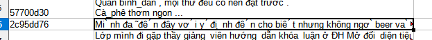
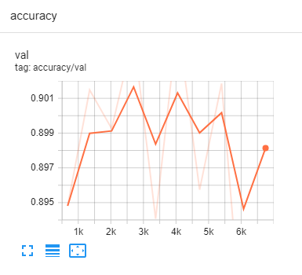

# Initial BERT Report

# INT3405

19020060 - Nguyễn Vũ Bình Dương

## Main points

1. BERT is a language model based on a deep learning model called *transformer*. Without further training, it can predict masked words in a paragraph and determine whether a sentence is the next sentence of a given sentence or not (This is the training objective of BERT).
2. The main difference between BERT and ULMFiT and ELMo is that BERT used transformer while ULMFiT and ELMo used LSTM. Transformer model process sentences as whole blocks(bidirectional) while LSTM process sentences sequentially.
3. BERT input is a sequence of words and with each word, BERT output an encoded version of that word (a vector) which can then be passed into some extra layers to do various jobs.
4. There are many ways of fine-tuning BERT. The most efficient way is to append some new layers and only update weights of newly added layers while training and keep pretrained BERT’s weights frozen.

## Data Preprocessing

The only problem I have are those sentences. I tried to process sentences like this but it didn't work out (Googled but couldn't find any method joining seperated accents and letters).

## Sample code execution

- [Colab Notebook](https://colab.research.google.com/drive/1uyJ-QcdHjDllCdCo91WBtZPei6tSKM-G?usp=sharing)
- [Tensorboard](https://tensorboard.dev/experiment/Lv1BERAdRDKjWBX1xKz1Lg/#scalars)

Sample code accuracy from tensorboard